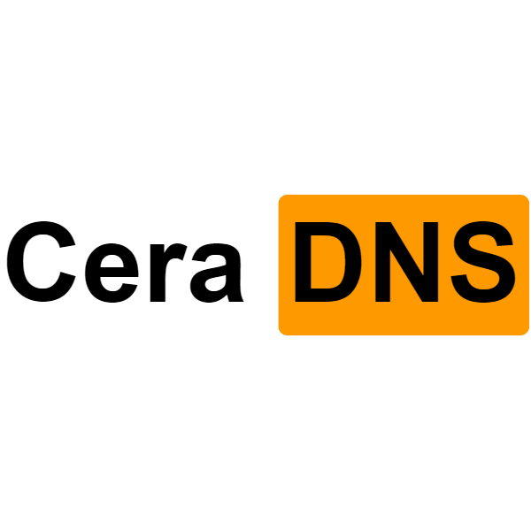

# CeraDNS+ Assets 元文件

## CeraDNS.png

随便生成的一个Cera~~Hub~~DNS的Logo

感谢V2EX网友制作的生成器 | [V2EX 原帖](https://www.v2ex.com/t/552573)

## SNI_Accelerate_List.txt

一个非常简陋的SNI加速列表

可以使用脚本工具生成Pcap_DNSProxy的配置文件 | [CeraDNS+ Tools](https://github.com/etnperlong/CeraDNS/tree/master/Tools)

如有更多需求欢迎向本项目提交 ISSUE